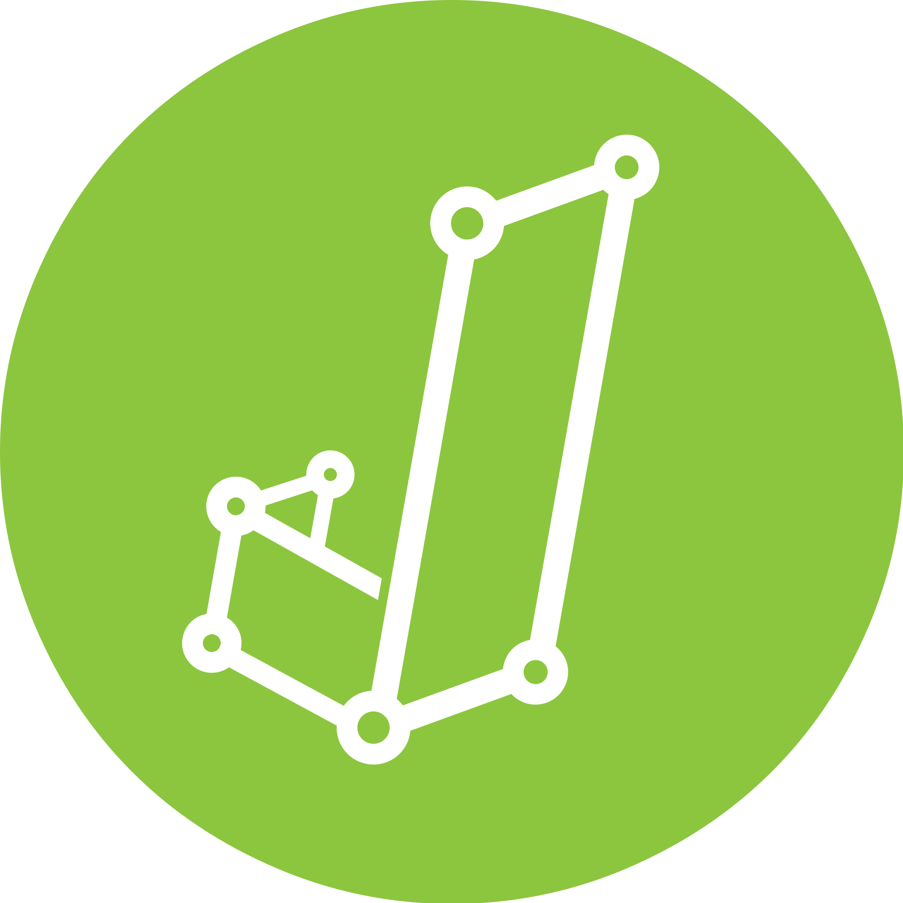

## PostNL
- *Cloud Engineer* | 2023 - present
- 
- Tags: PostNL
- Badges:
  - AWS [orange]
  - TypeScript [green]
  - Python [yellow]
  - GitHub Actions [purple]
- List Items:
  - Maintaining and improving the AWS landing zone for PostNL, used by 50+ engineering teams within the company.
  - Cloud Center of Excellence, supporting application teams.
  - Working with AWS Organizations, API Gateway, StackSets, Security Hub, and other services.

## PostNL
- *MLOps Engineer* | 2021 - 2023
- 
- Tags: PostNL
- Badges:
  - AWS [orange]
  - Python [yellow]
  - Docker [blue]
  - Airflow [red]
  - GitHub Actions [purple]
- List Items:
  - Automated deployment of data science pipelines through CI/CD pipelines with GitHub Actions and AWS CodePipeline. 
  - Data science pipelines were orchestrated by Airflow. 
  - Infrastructure as code with AWS CDK.

## University of Amsterdam
- *Student Assistant* | 2020 - 2021
- 
- Tags: Student Assistant
- Badges:
  - R [gray]
  - Shiny [pink]
- List Items:
  - During my studies I contributed to COVID related research, including creating a pipeline for social distancing data and modeling of the 'Coronadashboard' data.

## JASP
- *Student Assistant* | 2019 - 2021
- 
- Tags: Student Assistant
- Badges:
  - R [gray]
- List Items:
  - User-friendly alternative to SPSS, with focus on Bayesian statistics.

## University of Amsterdam
- *Master Behavioural Data Science* | 2020 - 2021
- 
- Tags: Education
- Badges:
  - Statistics [red]
  - Machine Learning [green]
  - Python [yellow]
  - R [gray]
- List Items: 
  - Master’s thesis: Predicting Mood From Passive Smartphone Data.

## University of Amsterdam
- *Bachelor Psychology* | 2017 - 2020
- 
- Tags: Education
- Badges:
  - Statistics [red]
  - R [gray]
- List Items:
  - Specialisation: Psychological Methods.