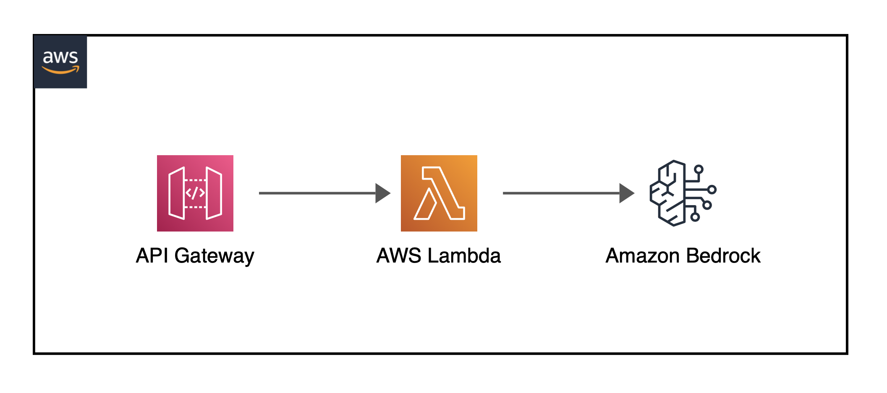

## API Gateway Integration with Amazon Bedrock
Small AWS CDK project that deploys an API endpoint to interact with a large language model from Amazon's generative AI service.
- 
- Tags: Category 1
- Badges:
  - AWS [orange]
  - TypeScript [green]
- Buttons:
  - GitHub Repo [https://github.com/mellevanderlinde/bedrock-apigateway]

## Project B
Description
- 
- Tags: Category 2
- Badges:
  - Badge [blue]
- Buttons:
  - Link [https://example.com]