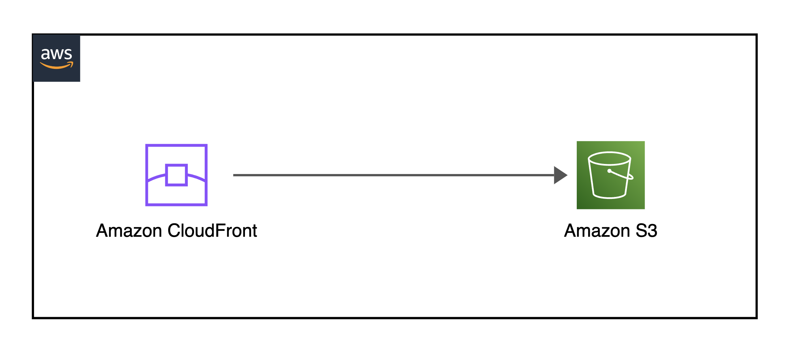
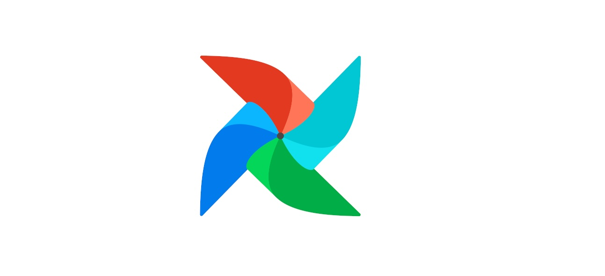

## API Gateway Integration with Amazon Bedrock
AWS CDK project that deploys an API endpoint to interact with a large language model from Amazon's generative AI service.
- 
- Tags: Category 1
- Badges:
  - AWS [orange]
  - TypeScript [green]
- Buttons:
  - GitHub Repo [https://github.com/mellevanderlinde/bedrock-apigateway]

## Portfolio with Amazon CloudFront
AWS CDK project that serves this portfolio with CloudFront. The portfolio design is a React template made by Eldora Boo.
- 
- Tags: Category 2
- Badges:
  - AWS [orange]
  - TypeScript [green]
- Buttons:
  - GitHub Repo [https://github.com/mellevanderlinde/portfolio-cloudfront]
  
## Apache Airflow on AWS
AWS CDK project that deploys an MWAA environment for Airflow and an example DAG.
- 
- Tags: Category 3
- Badges:
  - AWS [orange]
  - TypeScript [green]
  - Python [yellow]
- Buttons:
  - GitHub Repo [https://github.com/mellevanderlinde/mwaa-airflow]